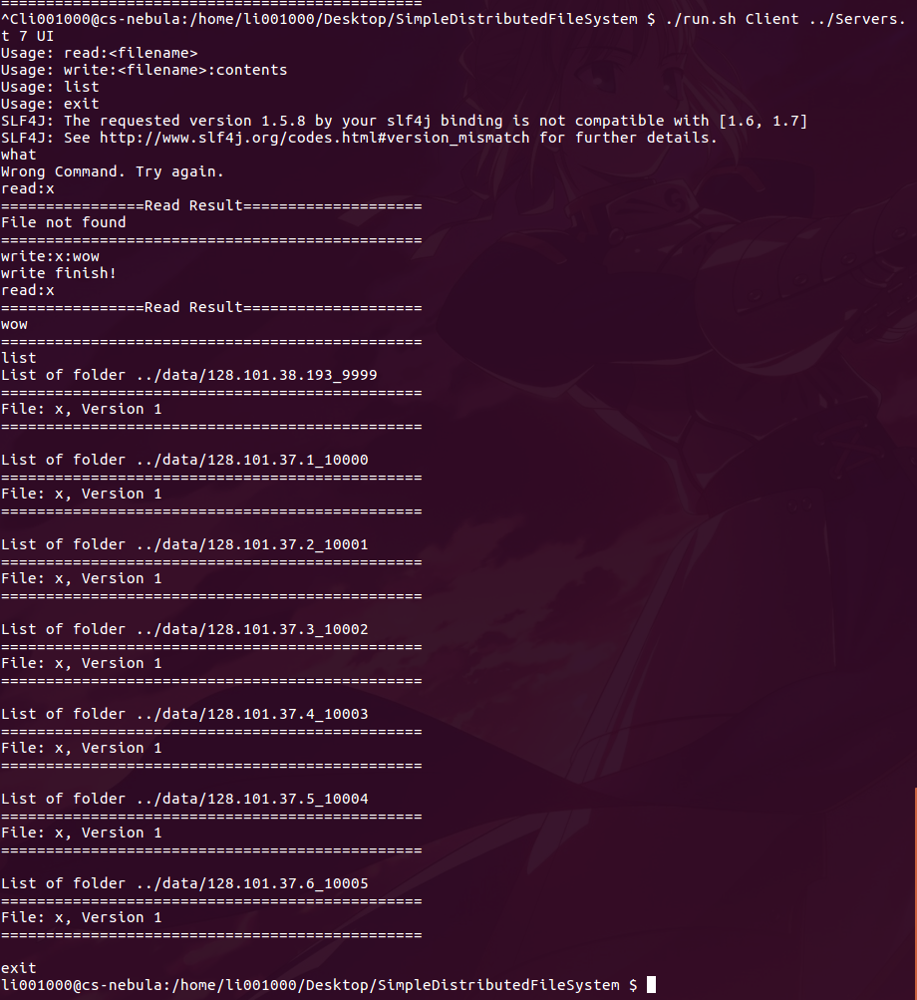

# Design Document

## 0. Requirement

* Eight machines (localhost for Client, one for Coor, five for Nodes)	
* thrift 0.9.3 (CSE lab's version)
* vim, Linux command, bash

thrift usage for this project (after generating `FileServer.java` file in `src/gen-java/` directory, please use `mv` command to move them into `src/` directory)

```bash
thrift -r --gen java FileServer.thrift
```

## 1. Client

The Client will only finish the test function for this project.

First it will open the transport to a random choose FileServer, and then show a command line like UI to handle the input from user. If you choose to run the Client in UI mode, you can enter `read`, `write`, `list` and `exit` command. If you input `exit`, the client will shutdown. If you input wrong command, it will say this is incorrect and ask you try again. If you input `list` command, the Client will contact all Servers and get . Below is an example.



For the read-heavy/write-heavy test, we will use the shell described in part `4.3`. In this test, each terminal will run the write and read operations to a random chosen server. In order to make our program robust, we will run the read operations first, and then run the write operations.

## 2. Server (store files)

* `void setData(String CoordinatorIP, int coordinatorPort, int port)`: this function will set the Coordinator's IP and port number to the FileServer, and it self port. Then the FileServer will make their own directory to store files.
* `int getVersionOf(String filename)`: this function will get the version number of the file required, if cannot find it, return -1;
* `String read(String filename)`: this function will forward the read operation to the Coordinator, and wait for the return value of Coordinator.
* `boolean write(String filename)`: this function if similar to the `read` function. It does not execute it, just forward to the Coordinator and wait the reply.
* `String doRead(String filename)`: this function is the "real" read function of the FileServer, and it will be called by the Coordinator. It will find the required file in its own directory, read the content and then return to the Coordinator.
* `boolean doWrite(String filename, String contents, int version)`: this function will update the versionMap of the FileServer, and write into the FileServer's directory. It will be called by the Coordinator.
* `String getFileList()`: this function will be called by the Client or the Coordinator. It will print all filenames, file versions, and file contents held by this FileServer.

## 3. Coordinator (also a FileServer)

The Coordinator extends the FileServer, but it also have other functions (or functions which have the same name but different implement) shown below.

* `CoordinatorHandler(int _nr, int _nw, int _n, String _ip, int _port)`: this function can help the Coordinator to set its own directory, and some other patrameters.
* `boolean join(String IP, int port)`: this function can help manage FileServers connected to Coordinator.
* `String read(String filename)`: this function will put the read request of this file in a queue (each file has its own queue), and wait for processing until the new request is at the head of the queue. In the processing operation, it will call the `ProcessReq` function.
* `String write(String filename, String contents)`: similar to `read` function of the Coordinator. Will return true after the `ProcessReq` function is done.
* `String ProcessReq(boolean RorW, String filename, String contents)`
    * for the read operation, `RorW` will be TRUE and `contents` will be `null`. This function will find the MaxVersion of the file, and return it back.
    * for the write operation, `RorW` will be FALSE. This function will find the MaxVersion and update it to all files which are chosen (set to be MaxVersion + 1).
* `boolean[] getTargetServer(int size)`: this function will return a boolean array that only `size` elements are TRUE. It will be called by the `ProcessReq` function to select Servers to read or write.
* `int findNewestIndex(String filename)`: return the machine index which holds the MaxVersion of this file.
* `int findVersion(int machine, String filename)`: return the version of filename on the machine required.
* `String findContent(int machine, String filename)`: return the content of filename on the machine required.
* `void printServers()`: will be called by `join` function to print all FileServers' information.
* `void sync()`: will be called every 1500ms by the Coordinator Server part. It will try to synchronize all file versions.

## 4. Useful scripts

### 4.1 `Makefile`

The `Makefile` gives us a easy way to compile the program and clean all the files produced. For the compile part, we can use `make` command to compile Client, Server, and Node. All source files are in `src/` directory while the result will be in `classes/` directory. For cleaning part, using `make clean` can clean the `class/` directory.

```Makefile
objects = class_dir Client FileServer Coordinator
FLAGS = -cp ".:/usr/local/Thrift/*" -d class -sourcepath src
all: $(objects)
.PHONY : all
class_dir:
	@if [ ! -d class ]; then mkdir class; else echo "/class already exists."; fi
Client:
	javac $(FLAGS) src/Client.java
FileServer:
	javac $(FLAGS) src/Server.java
Coordinator:
	javac $(FLAGS) src/Coordinator.java

.PHONY : clean
clean:
	@echo "Cleaning..."
	@rm -rf class/ data/
```

### 4.2 `run.sh`

```bash
#!/bin/bash
cd class
if [ $1 == 'Client' ]
then
    java -cp ".:/usr/local/Thrift/*" Client ${*:2}
elif [ $1 == 'Server' ]
then
    java -cp ".:/usr/local/Thrift/*" Server ${*:2}
elif [ $1 == 'Coordinator' ]
then
    java -cp ".:/usr/local/Thrift/*" Coordinator ${*:2}
else
    echo "Parameter Error. Using \"./run.sh Client\" , \"./run.sh Coordinator\" or \"./run.sh Server\" with parameters."
fi
```

This script can run the Client, Server or Coordinator with other parameters passed to the shell. For the usage, please refer to `README.md`.

### 4.3 `auto_test.sh`

```bash
#!/bin/bash
gnome-terminal -e "bash -c './run.sh Client ../Servers.txt 7 auto 1000 0 10;exec $SHELL'" &&
gnome-terminal -e "bash -c './run.sh Client ../Servers.txt 7 auto 1000 0 10;exec $SHELL'" &&
gnome-terminal -e "bash -c './run.sh Client ../Servers.txt 7 auto 1000 0 10;exec $SHELL'"
```

This script will open three new shell terminals to run three Clients. And then it will show the total cost time in each shell windows.

## 5. Others

* `Servers.txt` contains seven lines, each line contains <IP address>:<port number>.
* the usage descriptions are in the Client design part.

