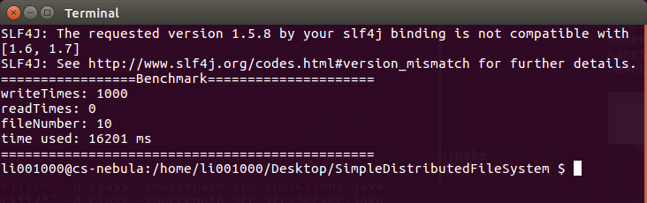
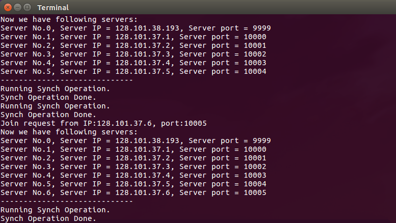
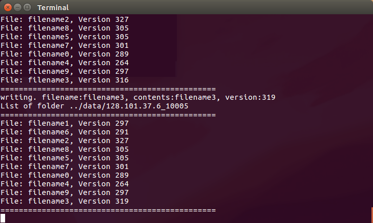
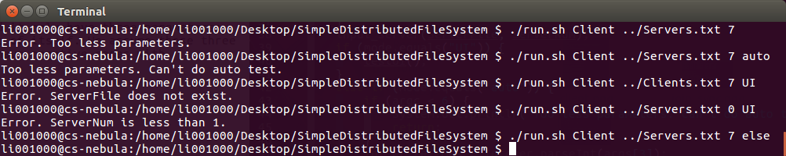
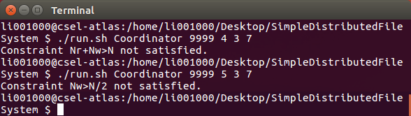
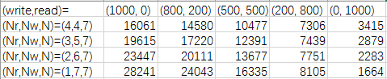
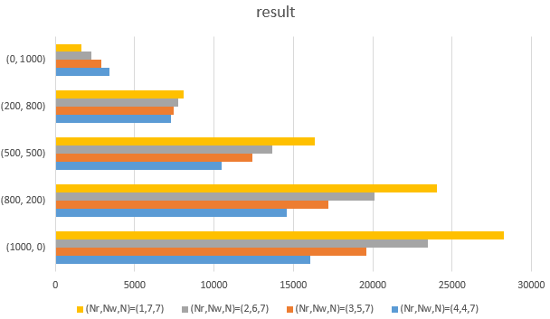

# Evaluation Document

## positive cases

For the usage of this project, you can refer to `README.md`. Here are some log information of Client, FileServers, and Coordinator. In order to understand this document better, please refer to `README.md` and `Design.md` first.

First I will show some pictures of the Client. In the design document, I already show the UI mode of Client, and then here is a result of the `auto_test.sh` (it is only one of three terminals):

Before three Clients deal with read and write operations, the Coordinator will connect with all FileServers to get their information. And every 1500ms, it will execute a synchronize operation, like below.

Also, the FileServer will print the version of files it holds, and will be synchronized by the Coordinator.

## negative cases

For Client: if you into too less parameters, the client will tell you directly. Also, when you input illegal parameters, it will also show you. And for the third parameter, if you input neither "UI" or "auto", the Client will shutdown. Please see the example below.

For Coordinator: if Nr, Nw, and N not satisfied the constraint (Nr+Nw>N, Nw>N/2), the program will return error and exit.

For the FileServer, it will register with the Coordinator first, and it only have three parameters: the IP address of Coordinator, the port of Coordinator, and the port of itself. We assume those three parameters are always satisfied with the requirement, so we do not have negative cases with FileServer.

## read-heavy and write-heavy

The data and figures shown in this part are all satisfied the situation that three Clients run together (we can use the `auto_test.sh` to easily implement it), and the cost time is the average among three Clients (three Clients have the same parameters). To make it simple, we only use 10 different files.

Here is the workload under (Nr,Nw,N) = (4,4,7), (3,5,7), (2,6,7), (1,7,7). All data in this table below is ms.

And then we can plot them:

Finally, let us discuss why the result will be in this way. We can see that the number of all operations that a Client will execute is 1000 (write + read). It is obvious that with the increment of write operation, the total cost time will go up since the write operation will cost more time than the read operation.

For all cases, the Nr+Nw=8, and with the increment of Nw, the time cost will go up, The reason is that the Coordinator will write on more FileServers. However, we also find another phenomenon. When the (write, read)=(0,1000), with the increment of Nw, the cost time goes down. That is because we do not have write operation now, so, the Nr is higher, the cost time is more.
